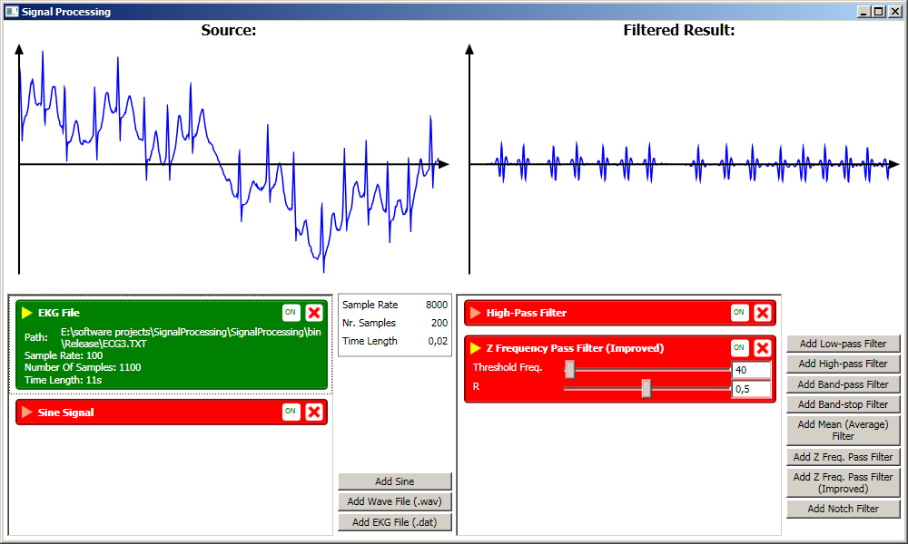

Signal Processing
===================================
Version 1.0 Released by [Alexandru Dorobanțiu](http://alex.dorobantiu.ro) (backend) and Andrei Marinică (frontend) on 27.01.2018

### Features
- simple digital signal processing filtering
- allows dynamic stacking of signals
- provides a reactive visualization of the output signal based on filtering parameter change
- contains implementation for three types of input signals: sine waves, ekg files (with provided samples), and wav files (simple loader)

### Technology:
 - Written in plain **C#** using **Visual Studio 2015** (upgraded from Visual Studio 2008)
 - **.NET** framework, version **3.5**
 - The front-end is implemented using XAML
 
#### Details
The purpose of the project is to provide an interactive experience with signal processing, to see how the output signals changes when different filters are applied.
8 types of filters were implemented, but the application can be easily extended.

#### Implementation Details
Disclaimer: The initial version of the program was developed during the Computer Science classes while we were in university and the code was mostly organised in our coding standards back then (2010), which were not intended to be compatible with industry style coding. The coding and naming conventions are a mix between C# and Java style (in a good sense).

##### Notes
 - the EKG loader uses a text file as input. The file is a conversion from binary EKG files which 
 - the program does not come with an installation package (ready for execution).

##### Screenshots

[][CreativeCommonsLicence]
 
This work is licensed under a [Creative Commons Attribution-NonCommercial-ShareAlike 4.0 International License][CreativeCommonsLicence]

[CreativeCommonsLicence]: http://creativecommons.org/licenses/by-nc-sa/4.0/
 